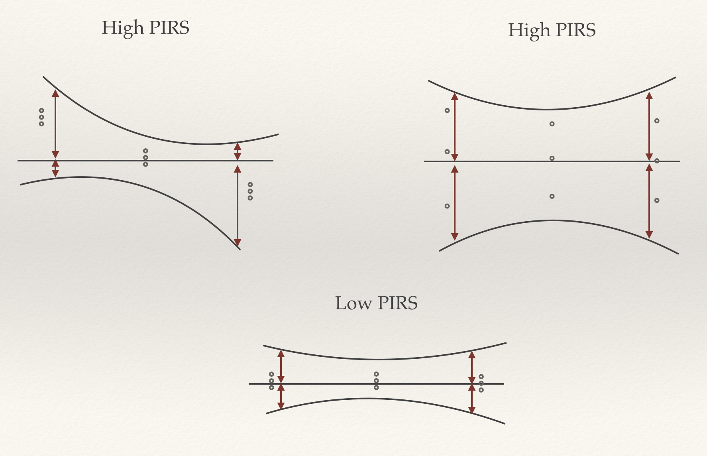

PIRS: Prediction Interval Ranking Score
=======================================

PIRS provides a means for identifying constitutive expression from time series data.  The software was designed for transcriptomic or proteomic data, but can be applied to any quantitative time series data. There is only one class 
rank, which performs the ranking.

----------
Motivation
----------

The issue of identifying increasing, decreasing or even cyclical patterns in time series data is well studied.  Little effort has been devoted to screening for stable expression.  Identifying constitutive expression is especially 
important when selecting reference genes which are later assumed to be stably expressed for purposes such as qPCR.  In the past many 'constitutively expresse' reference genes have later been identified to have circadian or other 
dynamic expression patterns.  PIRS provides for the systematic screening of expression profiles from high throughput time series to identify those which are truly constitutively expressed.

--------
Features
--------

* Prescreening of profiles for differential expression using ANOVA

* Ranking of peptides based on linear regression prediction intervals

-------------
Example Usage
-------------

```python
from PIRS import rank

data = rank.ranker(path_to_data)
sorted_data = data.pirs_sort()
```

### A Note on Data Formatting
PIRS expects input files to be formatted as tab seperated.  The first column should indicate the transcript or protein identifier.  The header should start with '#' and the rest of the header should be of the form 02_1 for data with
the first number indicating the timepoint and the second the replicate.  Single digit timepoints should include the leading zero for 
formatting. Missing values should be indicated by the string 'NULL'.  Example data file:

| # | 00_1 | 00_2 | 00_3 | 02_1 | 02_2 | 02_3 |
|---|---|---|---|---|---|---|
| ID | data | data | data | data | data | data |

------------
Installation
------------

pip install pirs

-------------------------------------
The Prediction Interval Ranking Score
-------------------------------------

How does PIRS identify constitutive expression?  Before answering this question, we should consider what characterizes constitutive expression.  We would expect such expression to be characterized by similar means across all 
timepoints and low variance relative to average expression for replicate timepoints.  How do we combine these two qualities into a single metric though?  In order to identify constitutive expression PIRS uses the 
prediction intervals from linear regressions.  A constitutive expression profile would be expected to have a narrow prediction interval which stays close to the overall mean of expression.  In contrast an upward or downward trend 
in expression would have a narrow prediction interval which would be farther from the mean expression at the beginning and end of the time series.  Lastly circadian or other dynamic expression centered on the mean expression would 
be expected to have wide prediction intervals which are far from the mean across the whole time series.  Each of these cases is pictured below:



After calculating the prediction intervals PIRS simply considers the sum of squared errors between the upper and lower bounds of the interval and the mean expression across all the observed time points.  This value is then scaled 
relative to the mean expression producing the final score. 

----
TO DO
----

* Implement simulations for user testing.

* Add API reference on readthedocs.

----
Built With
----

* numpy
* pandas
* scipy 
* sklearn 
* tqdm 

-------
License
-------

© 2017 Alexander M. Crowell: BSD-3
